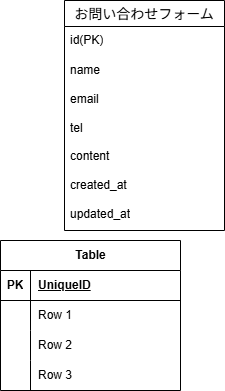

# laravel-docker-template

# お問い合わせフォーム

このリポジトリは、Laravel を使用して実装したお問い合わせフォームです。

---フォーム入力ページ---
① 入力欄（お名前） TextBox 名前を入力
② エラーメッセージ（お名前） Text 名前の入力に不備があったらエラーを表示
③ 入力欄（メールアドレス） TextBox メールアドレスを入力
④ エラーメッセージ（メールアドレス） Text メールアドレスの入力に不備があったらエラーを表示
⑤ 入力欄（電話番号） TextBox 電話番号を入力
⑥ エラーメッセージ（電話番号） Text 電話番号の入力に不備があったらエラーを表示
⑦ 入力欄（お問合せフォーム） TextBox お問合せ内容を入力
⑧ 送信ボタン Button 入力内容を送信した後、入力内容確認ページに遷移

---入力内容確認ページ---
① 入力内容表示 Table フォーム入力ページで入力した内容を表形式で表示する
② 送信ボタン Button 入力内容をデータベースに保存し、お問い合わせ完了ページに遷移

---お問い合わせ完了ページ---
説明箇所なし

## 環境構築

#### リポジトリをクローン

```
git clone git@github.com:Estra-Coachtech/laravel-docker-template.git
```

## リポジトリ名の変更

mv laravel-docker-template contact-form

## Git Hub でリモートリポジトリの URL 変更

contact-form と変更先のリモートリポジトリを public で作成。

作成できたらローカルリポジトリから紐づけ先変更。

作成したリポジトリから URL を取得してコマンド実行する。

## ローカルリポジトリから紐付け先を変更

'''
cd contact-form
'''
git remote set-url origin 作成したリポジトリの url
'''
git remote -v
'''

## ローカルリポジトリのデータをリモートリポジトリに反映

git add .
、、、
git commit -m "リモートリポジトリの変更"
、、、
git push origin main
、、、

#### Laravel のビルド

```
docker-compose up -d --build
```

code .

#### Laravel パッケージのダウンロード

```
docker-compose exec php bash
```

```
composer install
```

#### .env ファイルの作成

```
cp .env.example .env
```

exit

#### .env ファイルの修正

DB_HOST=mysql
DB_DATABASE=laravel_db
DB_USERNAME=laravel_user
DB_PASSWORD=laravel_pass

分からなかったら docker-compose.yml に記載されている。

## 権限エラーがでたら

.env は src 内にあるので cd src してから権限エラー解除する。

## php MyAdmin 確認

下記に記載してある URL でデータベースが存在しているのか確認できる。

## ルーティングの設定

GET / ContactController index
POST /contacts/confirm ContactController confirm
POST /contacts ContactController store

## コントローラ作成、記述

resources/views に、以下 3 つの Blade ファイルを作成する。

入力フォームの表示 index
確認画面の表示 confirm
データの保存と完了ページの表示 store

## css ファイル作成、記述

public/css に以下 4 つのファイルを作成する。
css ディレクトリも作成する。

リセット用 sanitize.css
index 用 index.css
confirm 用 confirm.css
thanks 用 thanks.css

## ContactController を作成、記述

PHP コンテナから artisan コマンドを使用して作成する。

php artisan make:controller ContactController

ContactController にアクションを作成。
index index.blade.php（フォーム入力ページ）を呼び出す

## ルーティングの設定

use App\Http\Controllers\ContactController;

GET / ContactController index

## フォーム入力ページ送信ボタンクリック時の処理

## アクション作成とルーティング設定

ContactController.php に confirm アクションを作成。

web.php に
POST /contacts/confirm ContactController confirm

## view から controller への値の送信

フォームに入力された値を controller に渡す処理を作成

index.blade.php

<form class="form" action="/contacts/confirm" method="post">

## csrf 攻撃対策

@csrf

## 入力内容確認ページの表示

フォーム入力ページから送られた入力内容を、入力内容確認ページに表示する処理を作成

ContactController.php に
confirm アクションの中で Request を使って記述。

## view へ値の受け渡し

名前、メールアドレス、電話番号、お問い合わせ内容の四つの情報を取得する必要があるため、各四つの値に指定したキーを記述する。
'name', 'email', 'tel', 'content'

controller では、view ファイルの呼び出しとそのファイルに渡す値の指定。
compact 関数を使う。

## 入力内容確認ページの送信ボタンを押した時の処理を作成

app/Http/Controllers/ContactController.php に、新しく store アクションを作成

## ルーティング設定

POST /contacts ContactController store

ルーティングが成立するように confirm.blade.php の form タグを編集する。

## 値の受け取り

confirm.blade.php の form タグから送信された値を受け取るように、ContactController.php の store アクションの記述を修正する。

## テーブル作成

PHP コンテナから php artisan コマンドで、マイグレーションを作成する。

php artisan make:migration create_contacts_table

## 作成されたテーブルの編集

up メソッドの中を編集し、テーブル設計にあったマイグレーションファイルを作成する。

## マイグレーション

php artisan migrate

## データベース保存

## Model 作成

contact テーブルを操作するための contact モデル作成。

php artisan make:model Contact

作成された Contact.php に protected $fillable を使って name, email, tel, content を操作可能にする記述する。

ContactController.php に保存処理を記述する。

Contact モデルを ContactController で使用するための記述
＋ store アクションも修正する。

## view 呼び出し

お問合せ完了ページに遷移させる。
store アクションの最後に thanks.blade.php を呼び出す記述をする。

## バリデーション

フォームリクエスト ContactRequest 作成、実装

php artisan make:request ContactRequest

名前 入力必須、文字列型、最大 255 文字
メールアドレス 入力必須、文字列型、メール形式、最大 255 文字
電話番号 入力必須、数値型、10〜11 桁の整数
お問い合わせ内容 なし

## フォームリクエストの認証判定

return true;

## フォームリクエストの設定

**FormRequest の呼び出し**

ContactController.php 上部に、ContactRequest を使うことを宣言する記述を加える。
use App\Http\Requests\ContactRequest;

confirm アクションと store アクションにバリデーションを設定
public function confirm(ContactRequest $request)

public function store(ContactRequest $request)

## エラーメッセージ

index.blade.php を編集。
バリデーションに引っかかったとき、それに対応したエラーメッセージを表示させる。
@error ディレクティブを使う。

@error(キー名)
{{ $message }}
@enderror

## エラーメッセージの編集

エラーの内容がわかりやすいように ContactRequest.php を変更する。

キー名.ルール => メッセージ

## 入力内容の保持

ルールを満たさない入力内容を送信し、リダイレクトする場合も、入力内容がリセットされないようにする。

{{old(キー名)}}

## 共通部分の layout 化

resource/views の中に layouts ディレクトリを作りその中に
app.blade.php ファイルを作成。
app.blade.php に共通している部分を記述。
異なる部分に

@yield(セクション名)

＊＊三つのビューファイル\*\*

@extends('layouts.app')

@section(セクション名)
// yield に埋め込みたい要素
@endsection

## layout 用 css ファイルの作成

common.css ファイルを作成
app.blade.php で common.css を呼び出す。

<link rel="stylesheet" href="{{ asset('css/common.css') }}" />

#### キー生成

```
php artisan key:generate
```

#### マイグレーション・シーディングを実行

```
php artisan migrate --seed
```

## 使用技術（実行環境）

フレームワーク：laravel 8.x

言語：php 7.3~ |php 8.0~ 対応

Web サーバー：Nginx 1.21

データベース：MySQL 8.0.26

## ER 図



## URL

アプリケーション：http://localhost

管理画面：なし

phpMyAdmin：http://localhost:8080
